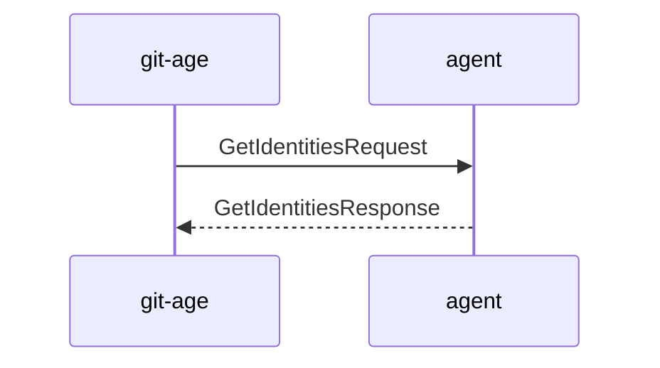
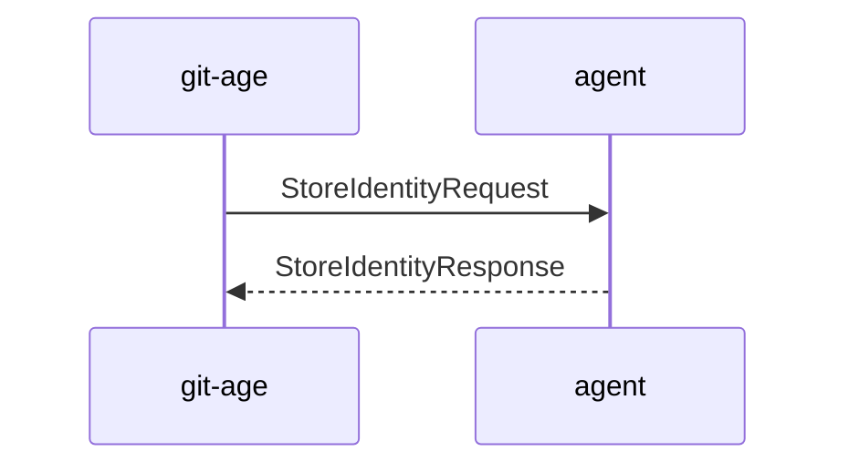

# Identities agent

_git-age_ normally reads identities from a `keys.txt` file e.g. in your home directory.
Alternatively, it can also look up identities with the help of an agent either running locally or even remotely.
If you would like to use an agent, you instruct _git-age_ where to find the endpoint of this agent with the help of the `GIT_AGE_AGENT_HOST` environment variable.

## Workflow

### Look up identities

Whenever _git-age_ has to decrypt a file (i.e. Git invokes it as smudge filter) it will check whether an agent is configured and if so, it will send a `GetIdentitiesRequest` containing the repositories remotes to the agent.
The agent can (optionally) use the remotes to filter for identities and reply with a set of identities _git-age_ will then try to use to decrypt the stanza:



### Generate new identity

When generating new identities (i.e. when invoking `git age gen-key`), _git-age_ will:

1. generate a new identity - typically a X25519 key pair
2. ask the first identity store to store the key pair
3. print the public key for further usage

_git-age_ always checks at first whether there's an agent available and if so uses that one as first store.



A user may optionally specify:

- a comment (`-c` \ `--comment`)
- a remote (`-r` \ `--remote`)

both will be shared with the agent, so it can filter all know identities based on the current repositories remotes.

## Implement a new agent

The agent protocol is gRPC based.
The spec of the protocol can be found either in the _git-age_ repository or in the [buf registry](https://buf.build/git-age/agent/docs/main:agent.v1).
Assuming you're going to use a programming language supported by buf, the recommended way is to use of the automatically provided SDKs from the buf registry.
Alternatively you can always pull the necessary protobuf files and generate the code in your programming language of choice.

Ideally, when starting your awesome agent, it should tell the user how to interact with it from _git-age_ perspective.

An output like:
```Bash
export GIT_AGE_AGENT_HOST="unix:///var/run/user/1000/git-age-keyring-agent.sock"
```
tells the user how to set up his environment to use your agent.

Apart from this, a _git-age_ agent is only a simple gRPC service that implements the `IdentitiesStoreService` spec.

### Security

Although gRPC supports/encourages the usage of TLS to secure the traffic between services, _git-age_ doesn't support TLS (yet).
This will be tackled soon™️.